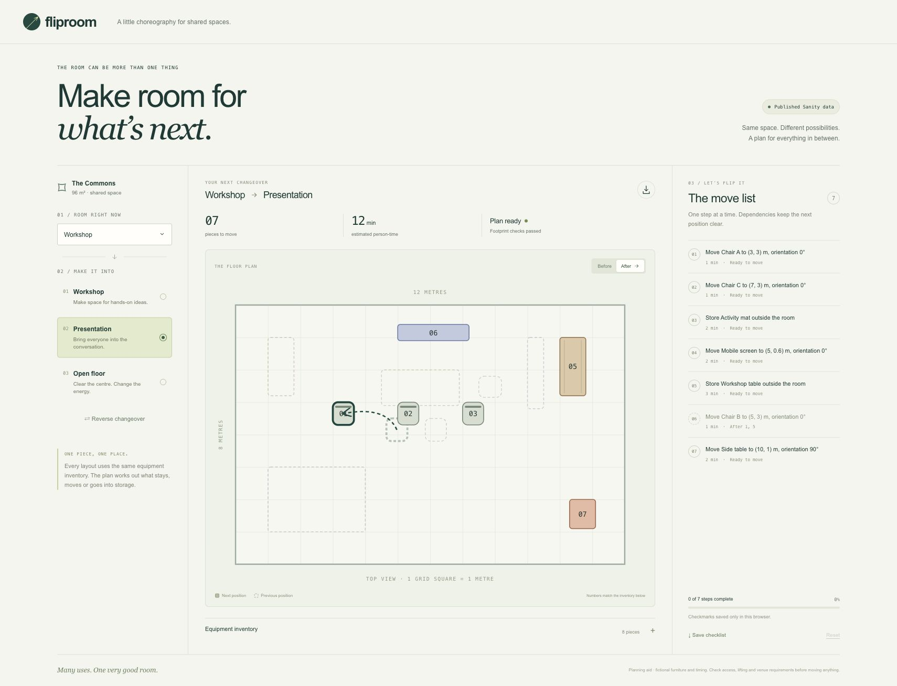

# Fliproom

A visual changeover planner for one fictional shared room. Choose two layouts, see their furniture footprints, and work through a dependency-aware move checklist. Created locally with AI coding assistance for a proposed DEV/Sanity Path Two entry. No entry has been submitted.



## Run locally

Node 22.12 or newer is required by the dependencies. Development used Node 26.7.

```sh
npm ci
npm run dev
```

Open http://127.0.0.1:3117. With no Sanity settings, the page explicitly uses fictional local data. `/studio` explains the missing connection.

```sh
npm test
npm run typecheck
npm run build
npm start
```

Run the development and production servers separately: both use port 3117. No model API calls, analytics or write endpoints are part of the planner.

## Sanity connection

For your own installation, use a Sanity project with a public dataset, copy `.env.example` to `.env.local`, and enter its project ID and dataset. The sample fits within Free-plan allowances. The seed command prints twelve fictional documents; it does not upload them:

```sh
npm run --silent seed:preview > seed.ndjson
```

Import the seed into your project through Sanity's Studio/CLI workflow. The app uses published-content reads and needs no read token for a public dataset. Seed IDs and references use hyphens: Sanity restricts anonymous access to IDs containing periods. Use `http://localhost:3333` for the local Studio when relying on Sanity's default allowed origin. Keep private or personal content out of the public dataset. A configured read failure remains an error; it never silently becomes a demo.

The catalog read may be cached for 60 seconds. Reload after a published Studio edit and allow the cache interval to pass. Checklist progress remains browser-local; the optional `changeoverRun` schema does not imply cloud synchronization.

For editing, stop the other development server, run `npm run studio`, and open `http://localhost:3333/studio`. Sign in with the account that owns your Sanity project. The editing session stays local; the public static build contains no Studio.

```sh
npm run check:live -- YOUR_PROJECT_ID YOUR_DATASET
```

That check reads without authentication, compares the catalog with the fictional seed, and checks all nine layout pairs. It is intended for an unchanged seed installation.

## Implementation

- `src/lib/planner.ts`: validation, footprint conflicts, move ordering and temporary parking.
- `src/lib/progress.ts`: dependency-aware checkmarks and content identity for saved plans.
- `src/components/Fliproom.tsx`: before/after diagrams, inventory and downloadable checklist.
- `src/sanity/`: referenced schemas, GROQ projection, validation and read-only loader.
- `scripts/seed.ts`: deterministic NDJSON export; `tests/`: planner, progress and actual GROQ tests.

Coordinates are top-left metres. Rotation 90 swaps width and height. The planner checks destination footprints, not walking or lifting paths, exits, capacity or room safety. Storage outside the room is assumed available when requested. Timing is fictional person-time, not measured elapsed duration. Checkmarks record user input, not proof of physical movement.

All sample room content and visuals were created for this app. No external images, user biography, contacts or research materials are used. Third-party dependencies retain their own licenses. App code is available under the [MIT license](LICENSE).

## Static website build

A separate export contains the planner and public Sanity reader. The editing Studio and import tool stay in the local installation.

```sh
NEXT_PUBLIC_SANITY_PROJECT_ID=YOUR_PROJECT_ID NEXT_PUBLIC_SANITY_DATASET=YOUR_DATASET npm run build:pages -- --base-path /fliproom
```

The command builds in an isolated temporary directory and prints its `out` path. It does not deploy anything. Add the exact website origin to Sanity's CORS list without credentials before serving that export publicly. Browser reads use no token, and a failed read displays a retry screen. The repository name must match the chosen base path. Static exports include `LICENSE` and generated `THIRD_PARTY_NOTICES.txt`; dependency notices retain their original licenses.

Local `.env` files, private attempt notes and evidence are ignored by Git. Never publish access tokens or private room content.
